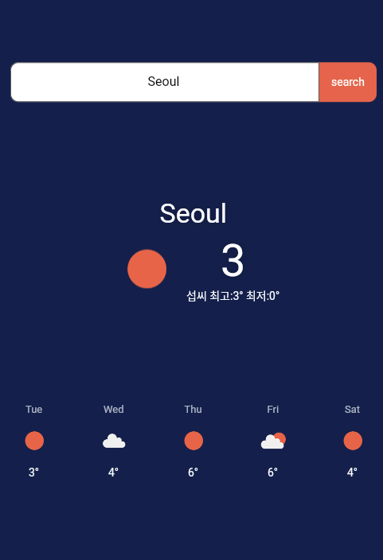

# Daygraph App
- seminar(2023-02-22)

An example Flutter weather app using the [OpenWeatherMap API](https://openweathermap.org/api)

## Supported Features

- [x] Current weather
- [x] 5-day weather forecast
- [x] Search by city

## App Architecture

The app is composed by three main layers.

- Data Layer
- Presentation Layer
- Domain Layer

## Packages in use

- [riverpod](https://pub.dev/packages/riverpod) for state management
- [freezed](https://pub.dev/packages/freezed) for code generation
- [http](https://pub.dev/packages/http) for talking to the REST API
- [cached_network_image](https://pub.dev/packages/cached_network_image) for caching images
- [mocktail](https://pub.dev/packages/mocktail) for testing

## About the OpenStreetMap weather API

The app shows data from the following endpoints:

- [Current Weather Data](https://openweathermap.org/current)
- [Weather Fields in API Response](https://openweathermap.org/current#parameter)
- [5 day weather forecast](https://openweathermap.org/forecast5)
- [Weather Conditions](https://openweathermap.org/weather-conditions)

### [LICENSE: MIT] Please copy me.